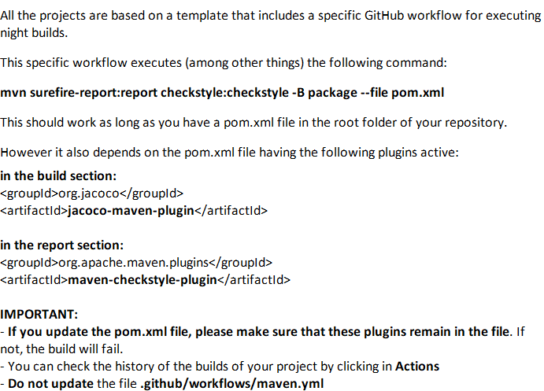

# US G003

## 1. Context

*Explain the context for this task. It is the first time the task is assigned to be developed or this tasks was incomplete in a previous sprint and is to be completed in this sprint? Are we fixing some bug?*

## 2. Requirements

As Project Manager, I want the team to use the defined project repository and continuous integration server.

## 3. Analysis

The repository was provided by the teacher and the team is using it to store the project's code. The continuous integration server was also provided by the teacher and the team is using it to build and test the project's code.
## 4. Design

N/A

### 4.1. Realization
N/A

### 4.2. Domain Model
N/A

### 4.2. Class Diagram
N/A

### 4.3. Applied Patterns
N/A

### 4.4. Tests

N/A

## 5. Implementation

## 6. Integration/Demonstration

N/A

## 7. Observations

N/A
