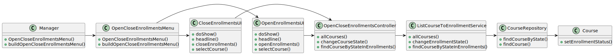

# US 1005 - Set the teachers of a course

## 1. Context

New feature to be developed.

**Github issue:** #27
## 2. Requirements

As a Manager, I want to open and close enrollments in courses.

## 2.1 Client Clarifications

**Q:** In the document you provided it says "A course may be open or closed." but I saw a post of yours where you
mentioned "(before this course is changed to "in progress")".

So does that mean it can be open (to enroll), closed(after it ends) and in progress(decurring, closed for enrollment)?

**A:** A course may have several states. Section "5.2.1 Course" exemplifies the usual cycle of a course.

---
## 2.2 Demos

## 3. Analysis

### 3.1 Pre Requirements

- Manager must exist
- Course must exist
- Course must be in the "open" state

### 3.2 Post Requirements

- The Manager can change the course state.

### 3.3 Business Rules

- A manager can open or close more than one course.
- A course must be in the "open" state to be available for enrollment.

## 4. Design

### 4.1. Realization

#### 4.1.1. UC Realization

    The system presents a list of courses. 
    The manager selects a course.
    The system presents a list of courses in the Open state.
    The manager selects a course.
    The system asks if they want to open or close enrollment.
    The manager chooses the desired option.
    The system changes the state of the course.

#### 4.1.2. Sequence Diagram

#### 4.1.3 Class Diagram

## 4.2 Applied Patterns

### 4.2.1 Architectural  Pattern

An **Onion Architectural Pattern** was used in order to achieve a lower coupling of the system since the dependency was
from the outer to the inner layer. A better maintainability of the system is another consequence of the chosen design

**presentation -> application -> service -> Repository**

### 4.2.2 Design Patters

#### Controller

The controller pattern assigns the responsibility of dealing with system events to a non-UI class that represents the
overall system or a use case scenario.
In this UseCase **OpenCloseEnrollmentsController** is responsible for organising the use case logic.

#### Factory and Repository

These patterns helped in the persistence, storage and data access.
It is used in the instantiation of the **CourseRepository** in order for the system to have access to the
TeacherAssignment data and save the new TeacherAssignment.
The repositories are accessed by the RepositoryFactory using the Service class.

#### High-Cohesion, Low-Coupling
**Low coupling** is an evaluative pattern that dictates how to assign responsibilities for the following benefits:
* lower dependency between the classes,
* change in one class having a lower impact on other classes,
* higher reuse potential.

**High cohesion** means that the responsibilities of a given set of elements are strongly related and highly focused on
a rather specific topic.

In this UseCase we can see in the following examples:

* CourseRepository is just a repository of Courses, where the data related to them are saved and accessed;
* ListCourseToEnrollmentService is a class that connects to the course repositories and returns the data to the
  controller.

#### Information Expert

This pattern leads to placing the responsibility on the class with the most information required to fulfill it.

## 4.3 Tests

N/A

## 5. Implementation

OpenCloseEnrollmentsController
public class OpenCloseEnrollmentsController {

    private final AuthorizationService authz = AuthzRegistry.authorizationService();
    private final CourseRepository courseRepository = PersistenceContext.repositories().courses();
    private final ecourse.openCloseEnrollment.application.ListCourseToEnrollmentService enrollmentInCourseService = new ListCourseToEnrollmentService();

    public Iterable<Course> allCourses() {
        return this.enrollmentInCourseService.allCourses();
    }

    public Course changeCourseState(final Course course) {
        authz.ensureAuthenticatedUserHasAnyOf(BaseRoles.MANAGER);
        return this.enrollmentInCourseService.changeEnrollmentState(course);

    }

    public Iterable<Course> findCourseByStateInEnrollments(CourseStateEnum courseState) {
        authz.ensureAuthenticatedUserHasAnyOf(BaseRoles.MANAGER);
        return this.enrollmentInCourseService.findCourseByStateInEnrollments(courseState);
    }

}

ListCourseToEnrollmentService
public class ListCourseToEnrollmentService {

    private final AuthorizationService authz = AuthzRegistry.authorizationService();
    private final CourseRepository courseRepository = PersistenceContext.repositories().courses();

    public Iterable<Course> allCourses() {
        authz.ensureAuthenticatedUserHasAnyOf(BaseRoles.MANAGER);

        return courseRepository.findAll();
    }

    public Course changeEnrollmentState(Course course) {
        authz.ensureAuthenticatedUserHasAnyOf(BaseRoles.MANAGER);

        if (CourseStateEnum.OPEN.equals(course.courseState())){
            course.changeState(CourseStateEnum.ENROLL);

        } else {
            course.changeState(CourseStateEnum.IN_PROGRESS);
        }
    	return courseRepository.save(course);
    }

    public Iterable<Course> findCourseByStateInEnrollments(CourseStateEnum courseState) {
            authz.ensureAuthenticatedUserHasAnyOf(BaseRoles.MANAGER,
                    BaseRoles.MANAGER);
            return courseRepository.findCourse(courseState);

        }

    }

## 6. Integration/Demonstration

*N/A*

## 7. Observations

**Last minute we had to rename the project and this US is not aligned with the Master, in the next sprint we will take
that into consideration.*

*

