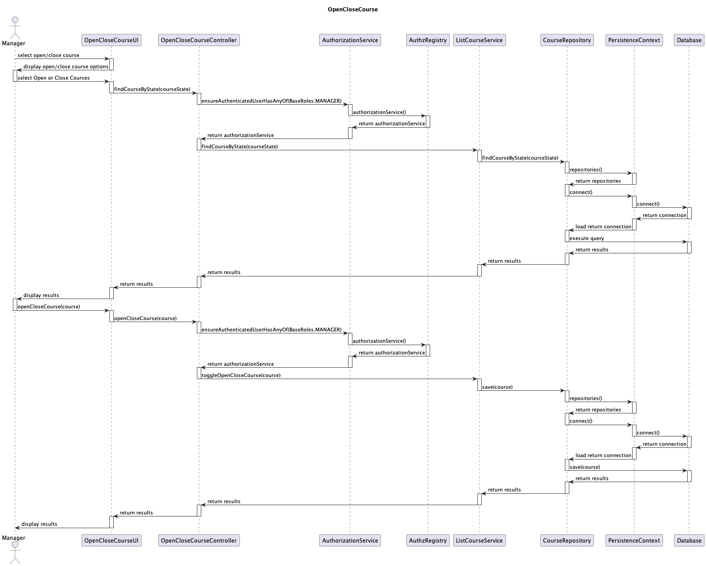
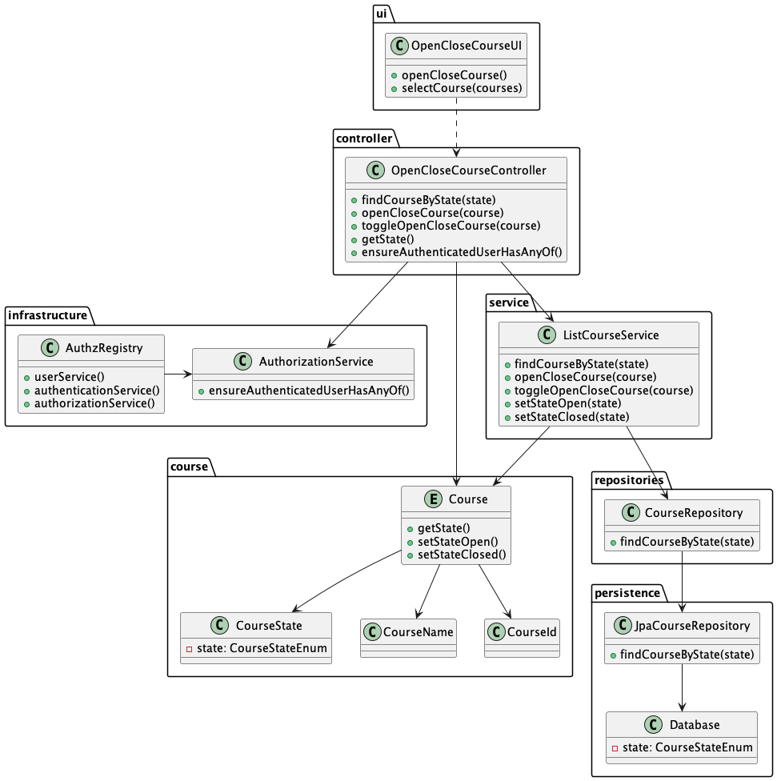

# US 1004

## 1. Context

Enabling the courses created to change their status to "Open" or "Closed", this will allow the courses to be available
for the students to enroll in them.

## 2. Requirements

As a Project Manager, I want to open and close courses.

## 3. Analysis

By adopting the **EAPLI Framework**, we have already implemented the authentication and authorization mechanisms.
The framework provides a default implementation of the authentication and authorization mechanisms,
which can be used as is or extended to meet the project's needs.
The Manager should be able to select a course and change its status to "Open" or "Closed".
To do this, the Manager must be authenticated and authorized to perform this action.
Also the Manager should be able to see the list of courses and their status, in the case of the status being "Close"
it should allow the Manager to change the status to "Open", and in the case of the status being "Open" it should allow
the Manager to change the status to "Close".

## 4. Design

### 4.1. Sequence Diagram

### 4.2. Class Diagram

### 4.3. Applied Patterns

The implementation pattern being used is the Model-View-Controller (MVC) pattern.

In this pattern, the code is divided into three interconnected components: the Model, the View, and the Controller.

- The Model represents the data and the business logic of the application. In this class diagram, the `Course` entity
 and the `CourseState` class are part of the Model.

- The View represents the user interface of the application. In this class diagram, the `OpenCloseCourseUI` class is
 part of the View.

- The Controller acts as an intermediary between the Model and the View. It receives input from the user via the View, 
 processes it using the Model, and updates the View accordingly. In this class diagram, the `OpenCloseCourseController` class is part of the Controller, and it interacts with the `ListCourseService`, `AuthorizationService`, and `CourseRepository` classes to perform the necessary actions.

### 4.4. Tests

N/A

## 5. Implementation

N/A

## 6. Integration/Demonstration

N/A
## 7. Observations

N/A