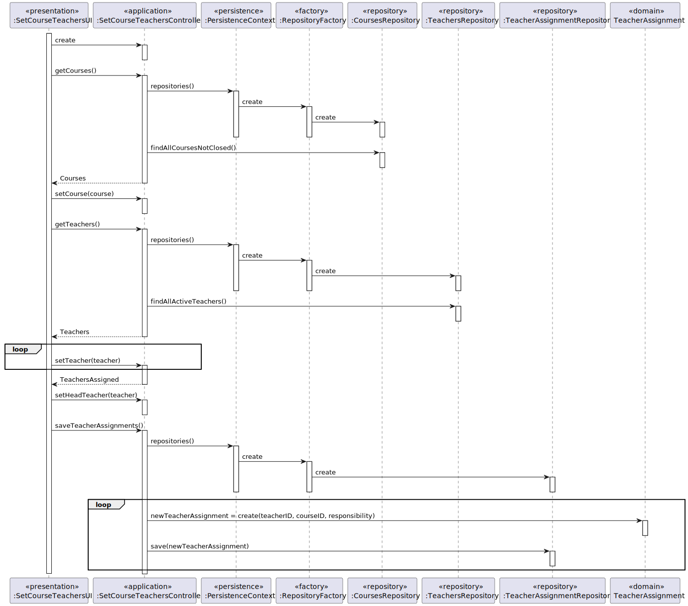

# US 1005 - Set the teachers of a course

## 1. Context

New feature to be developed.

**Github issue:** #25
## 2. Requirements

As Manager, I want to set the teachers of a course.

## 2.1 Client Clarifications

**Q:** Teacher in charge and normal class teacher responsibilities

**A:** For the requirements of the system you may consider that the roles of teacher and teacher in charge have the same capabilities. The only rule is that each course must have one teacher in charge. So, the system must register the teacher in charge for each course.
The teacher in charge has more responsibilities than a regular teacher but, for the moment, they are outside the system to be developed (for instance, the program and contents of the course are a responsibility of the teacher in charge).

---
**Q:** It is mentioned that only one teacher can be in charge of a course, but can the same teacher be in charge of several other courses?

**A:** Yes, a teacher can be in charge of several courses

---
## 2.2 Demos

## 3. Analysis

### 3.1 Pre Requirements

- Manager must exist
- Teacher must exist
- Course must exist

### 3.2 Post Requirements

- Teacher must be set to the course

### 3.3 Business Rules
- A teacher can be in charge of several courses.
- A course must have one teacher in charge.
- A course can have several teachers.
- Only a manager can set the teachers of a course.

## 4. Design

### 4.1. Realization

#### 4.1.1. UC Realization

    The manager  starts the US by selecting the option to set the teachers of a course. 
    The system presents a list of courses. 
    The manager selects a course. 
    The system presents a list of teachers. 
    The manager selects a teacher. 
    The system sets the teacher to the course.

#### 4.1.2. Sequence Diagram

#### 4.1.3 Class Diagram

## 4.2 Applied Patterns

### 4.2.1 Architectural  Pattern
An **Onion Architectural Pattern** was used in order to achieve a lower coupling of the system since the dependency was from the outer to the inner layer. A better maintainability of the system is another consequence of the chosen design

**presentation -> application -> persistence -> domain**

### 4.2.2 Design Patters

#### Controller
The controller pattern assigns the responsibility of dealing with system events to a non-UI class that represents the overall system or a use case scenario.
In this UseCase **SetCourseTeacherController** is responsible for organising the use case logic.

#### Factory and Repository
These patterns helped in the persistence, storage and data access.
It is used in the instantiation of the **TeacherAssignmentRepository** in order for the system to have access to the TeacherAssignment data and save the new TeacherAssignment.
The repositories are accessed by the RepositoryFactory using the PersistenceContext interface

#### High-Cohesion, Low-Coupling
**Low coupling** is an evaluative pattern that dictates how to assign responsibilities for the following benefits:
* lower dependency between the classes,
* change in one class having a lower impact on other classes,
* higher reuse potential.

**High cohesion** means that the responsibilities of a given set of elements are strongly related and highly focused on a rather specific topic.

In this UseCase we can see in the following examples:

* TeacherAssignmentRepository, is just  a repository of teacher assignments, were the data related to them are saved and accessed;
* PersistenceContext is an ‘interface’ that recalls the FactoryRepository
* RepositoryFactory is a repository's factory from we can access the TeacherAssignmentRepository;

#### Information Expert
This pattern leads to placing the responsibility on the class with the most information required to fulfill it.

## 4.3 Tests
*Nesta secção deve sistematizar como os testes foram concebidos para permitir uma correta aferição da satisfação dos requisitos.*

**Teste 1:** 

## 5. Implementation

*Nesta secção a equipa deve providenciar, se necessário, algumas evidências de que a implementação está em conformidade com o design efetuado. Para além disso, deve mencionar/descrever a existência de outros ficheiros (e.g. de configuração) relevantes e destacar commits relevantes;*

*Recomenda-se que organize este conteúdo por subsecções.*

## 6. Integration/Demonstration

*N/A*

## 7. Observations

To-Do: Ensure there is only one head teacher per course

