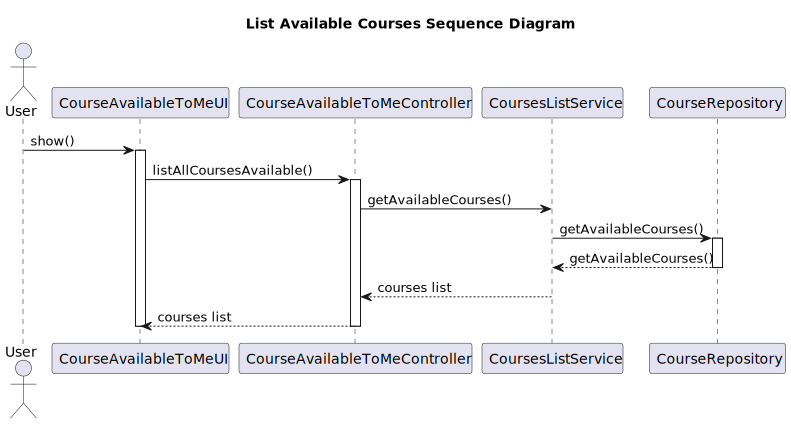
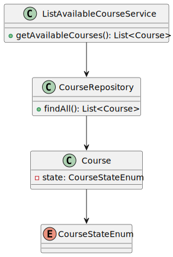

# US 1010 - Schedule a Course Class

## 1. Context

New feature to be developed.

**Github Issue:** #24

## 2. Requirements

As User, I want to list all the courses that are available to me

## 2.1 Client Clarifications

***Q:** Relative to this US, "As User, I want to list all the courses that are available to me" what should we list
according to the User role?

Student: Courses that Student is enrolled

Teacher: Courses that Teacher teaches

Manager: All Courses

**A:** Regarding Teachers and Managers I agree with you.

Regarding students I think it is best to list all the courses in which the student is enrolled or may be enrolled (the
enrolments are opened). If not, how would a student know the courses in which he/she can enrol?

---

## 2.2 Demos

## 3. Analysis

### 3.1 Pre Requirements

- Course must exist

### 3.2 Post Requirements

- A list of available courses is shown to the user.

### 3.3 Business Rules

-
    - The student must be registered in the system.
-

## 4. Design

### 4.1. Realization

#### 4.1.1. UC Realization

- Manager, student or teacher can start the available courses visualization application.
- The system shows the available courses.

#### 4.1.2. Sequence Diagram

#### 4.1.3 Class Diagram

## 4.2 Applied Patterns

### 4.2.1 Architectural  Pattern

An **Onion Architectural Pattern** was used in order to achieve a lower coupling of the system since the dependency was
from the outer to the inner layer. A better maintainability of the system is another consequence of the chosen design

**presentation -> application -> persistence -> domain**

### 4.2.2 Design Patters

#### Controller

The controller pattern assigns the responsibility of dealing with system events to a non-UI class that represents the
overall system or a use case scenario.
In this UseCase **listAllCoursesAvailableToMeController** is responsible for organising the use case logic.

#### Factory and Repository

These patterns helped in the persistence, storage and data access.
It is used in the instantiation of the **CourseRepository** in order for the system to have access to the students
enrollments data and save the approval/rejection of the same.
The repositories are accessed by the RepositoryFactory using the PersistenceContext interface

#### High-Cohesion, Low-Coupling

**Low coupling** is an evaluative pattern that dictates how to assign responsibilities for the following benefits:

* lower dependency between the classes,
* change in one class having a lower impact on other classes,
* higher reuse potential.

**High cohesion** means that the responsibilities of a given set of elements are strongly related and highly focused on
a rather specific topic.

In this UseCase we can see in the following examples:

* CourseRepository, is just a repository of scheduled course classes, were the data related to them are saved and
  accessed;
* PersistenceContext is an ‘interface’ that recalls the FactoryRepository
* RepositoryFactory is a repository's factory from we can access the CourseRepository;

#### Information Expert

This pattern leads to placing the responsibility on the class with the most information required to fulfill it.

## 4.3 Tests

N/A

## 5. Implementation

listAllCoursesAvailableToMeController
public class listAllCoursesAvailableToMeController {
private final AuthorizationService authz = AuthzRegistry.authorizationService();
private final ListAvailableCourseService availableCourseService = new ListAvailableCourseService();

    public listAllCoursesAvailableToMeController() {
    }

    public List<Course> availableCourses() {
        return availableCourseService.getAvailableCourses();
    }

ListAvailableCourseService

public class ListAvailableCourseService {

    private final AuthorizationService authz = AuthzRegistry.authorizationService();
    private final CourseRepository courseRepository = PersistenceContext.repositories().courses();

    public List<Course> getAvailableCourses() {

        List<Course> allCourses = (List<Course>) courseRepository.findAll();
        List<Course> coursesAvailable = new ArrayList<>();

        for (Course course : allCourses) {
            if (course.courseState() == CourseStateEnum.ENROLL ){
                coursesAvailable.add(course);
            }
        }

        return coursesAvailable;
    }

}

## 6. Integration/Demonstration

*N/A*

## 7. Observations

*Last minute we had to rename the project and this US is not aligned with the Master, in the next sprint we will take
that into consideration.*

