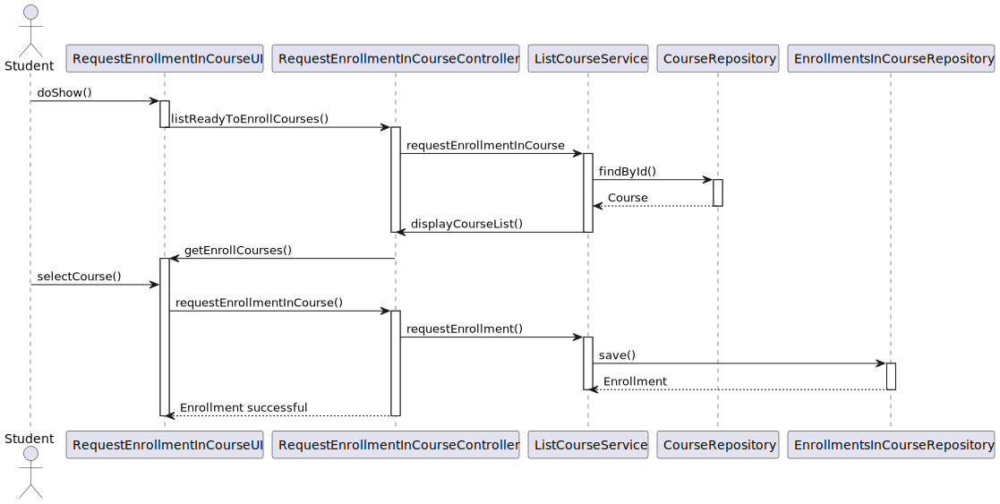

# US 1005 - Set the teachers of a course

## 1. Context

New feature to be developed.

**Github issue:** #22

## 2. Requirements

As Student, I want to request my enrollment in a course.

## 2.1 Client Clarifications

N/A

---

## 2.2 Demos

## 3. Analysis

### 3.1 Pre Requirements

- Manager must exist
- Student must exist
- Course must exist
- Course in state enroll available

### 3.2 Post Requirements

- The student is able to enroll in the course.

### 3.3 Business Rules

- A student can only enroll in one course at a time.
- A student can only enroll in a course that is in the "enroll" state.

## 4. Design

### 4.1. Realization

#### 4.1.1. UC Realization

    The student starts the US by selecting the course they want to enroll in.
    The system presents a list of courses.
    The student selects a course.

#### 4.1.2. Sequence Diagram

#### 4.1.3 Class Diagram

## 4.2 Applied Patterns

### 4.2.1 Architectural  Pattern

An **Onion Architectural Pattern** was used in order to achieve a lower coupling of the system since the dependency was
from the outer to the inner layer. A better maintainability of the system is another consequence of the chosen design

**presentation -> application -> persistence -> domain**

### 4.2.2 Design Patters

#### Controller

The controller pattern assigns the responsibility of dealing with system events to a non-UI class that represents the
overall system or a use case scenario.
In this UseCase **RequestEnrollmentInCourseController** is responsible for organising the use case logic.

#### Factory and Repository

These patterns helped with persistence, storage, and data access.
They are used in the instantiation of the **CourseRepository** so that the system can access the available course data.
The EnrollmentsInCourseRepository repository is used to store the enrollment.
The repositories are accessed by the RepositoryFactory using the PersistenceContext interface.

#### High-Cohesion, Low-Coupling

**Low coupling** is an evaluative pattern that dictates how to assign responsibilities for the following benefits:

* lower dependency between the classes,
* change in one class having a lower impact on other classes,
* higher reuse potential.

**High cohesion** means that the responsibilities of a given set of elements are strongly related and highly focused on
a rather specific topic.

In this UseCase we can see in the following examples:

* EnrollmentsInCourseRepository is just a repository where the enrollment of a student in a course is stored;
* PersistenceContext is an 'interface' that calls the FactoryRepository;
* RepositoryFactory is a repository factory from which we can access the EnrollmentsInCourseRepository.

#### Information Expert

This pattern leads to placing the responsibility on the class with the most information required to fulfill it.

## 4.3 Tests

N/A

## 5. Implementation

RequestEnrollmentInCourseController

    public class RequestEnrollmentInCourseController {
    private final ListCourseService listCourseService = new ListCourseService();

    /**
     * Gets list of courses that are ready to enroll
     *
     * @return list of courses
     */
    public List<Course> listReadyToEnrollCourses() {
        return listCourseService.getEnrollCourses();
    }

    /**
     * Requests enrollment in a course
     *
     * @param course to enroll in
     * @return true if the enrollment was requested successfully, false otherwise.
     */
    public boolean requestEnrollmentInCourse(Course course) {
        return listCourseService.requestEnrollment(course);
    }

ListCourseService

    public class ListCourseService {
    private final AuthorizationService authz = AuthzRegistry.authorizationService();
    private final CourseRepository courseRepository = PersistenceContext.repositories().courses();
    private final EnrollmentsInCourseRepository enrollmentRepository = PersistenceContext.repositories().enrollmentsInCourse();

    /**
     * Get all courses
     *
     * @return Iterable of courses
     */
    public Iterable<Course> allCourses() {
        authz.ensureAuthenticatedUserHasAnyOf(BaseRoles.MANAGER,
                BaseRoles.MANAGER);

        return courseRepository.findAll();
    }

    /**
     * Get a course by its id
     *
     * @param id Course id
     * @return Optional of course
     */
    public Optional<Course> findById(UUID id) {
        return courseRepository.ofIdentity(id);
    }

    /**
     * Get all courses that are in the ENROLL state
     *
     * @return List of courses
     */
    public List<Course> getEnrollCourses() {
        return StreamSupport.stream(courseRepository.findAll().spliterator(), false)
                .filter(course -> course.courseState() == CourseStateEnum.ENROLL)
                .toList();
    }

    /**
     * Requests enrollment in a course
     *
     * @param course to enroll in
     * @return true if the enrollment was requested successfully, false otherwise.
     */
    public boolean requestEnrollment(Course course) {
        if (course != null && course.courseState() == ENROLL) {
            if (authz.session().isEmpty()) {
                return false;
            }

            enrollmentRepository.save(new Enrollment(authz.session().get().authenticatedUser().username().toString(), Calendar.getInstance(), course, REQUEST));
            return true;
        }
        return false;
    }

}

## 6. Integration/Demonstration

*N/A*

## 7. Observations

*The project has been renamed and this User Story does not include these changes. It will be corrected in the next
sprint.*

