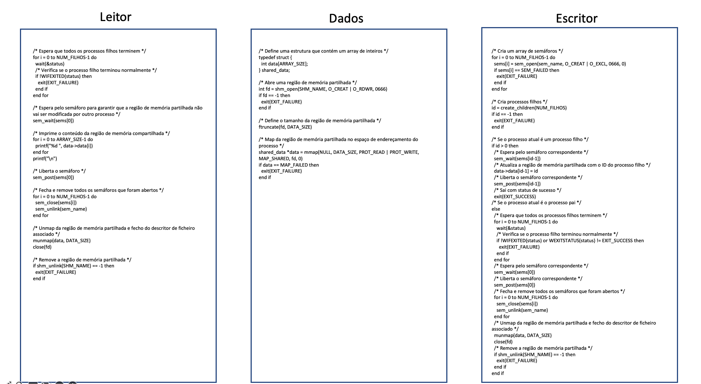
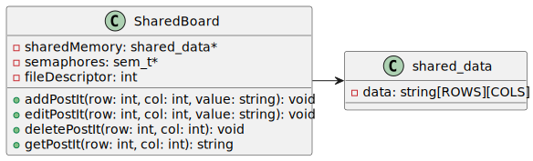
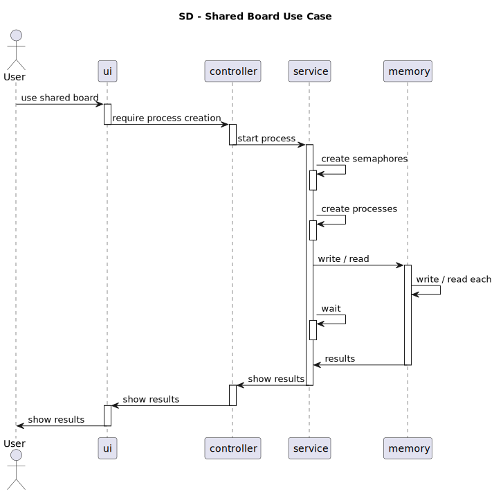
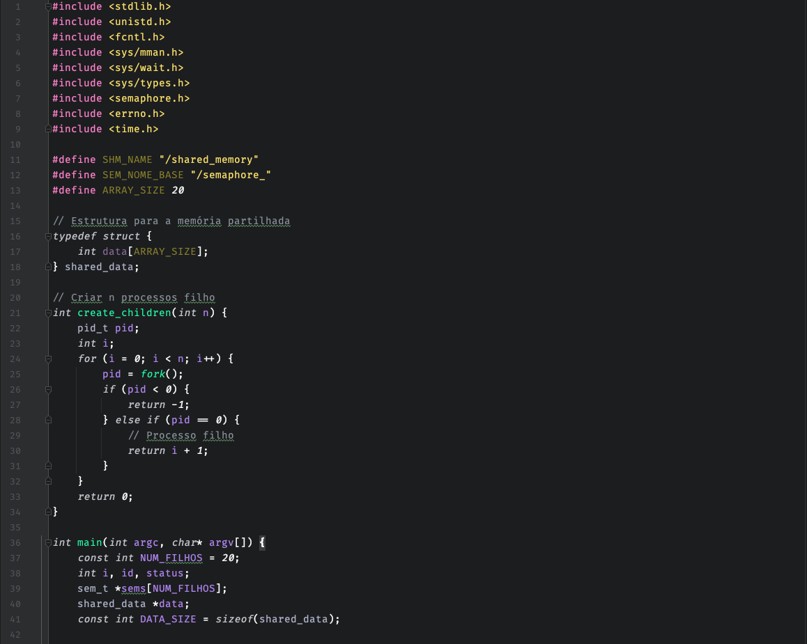
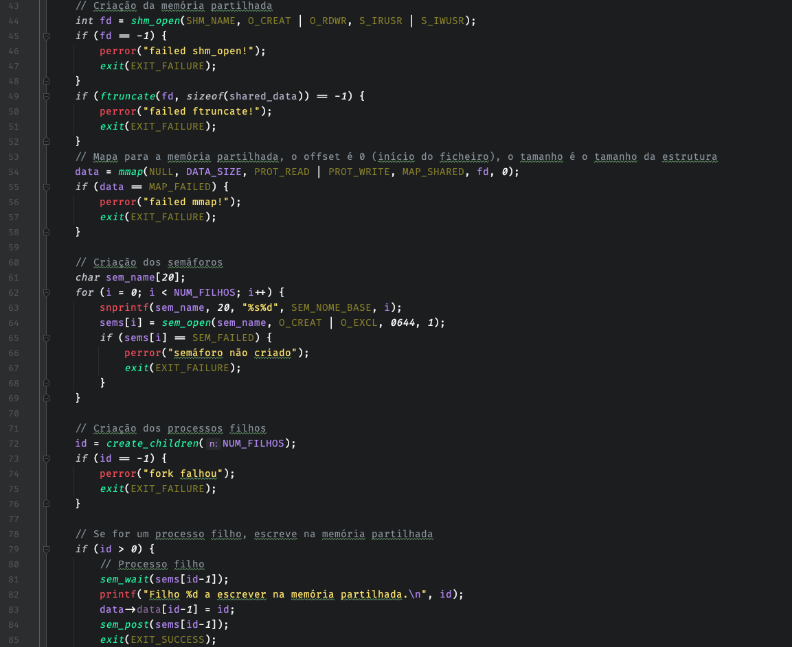
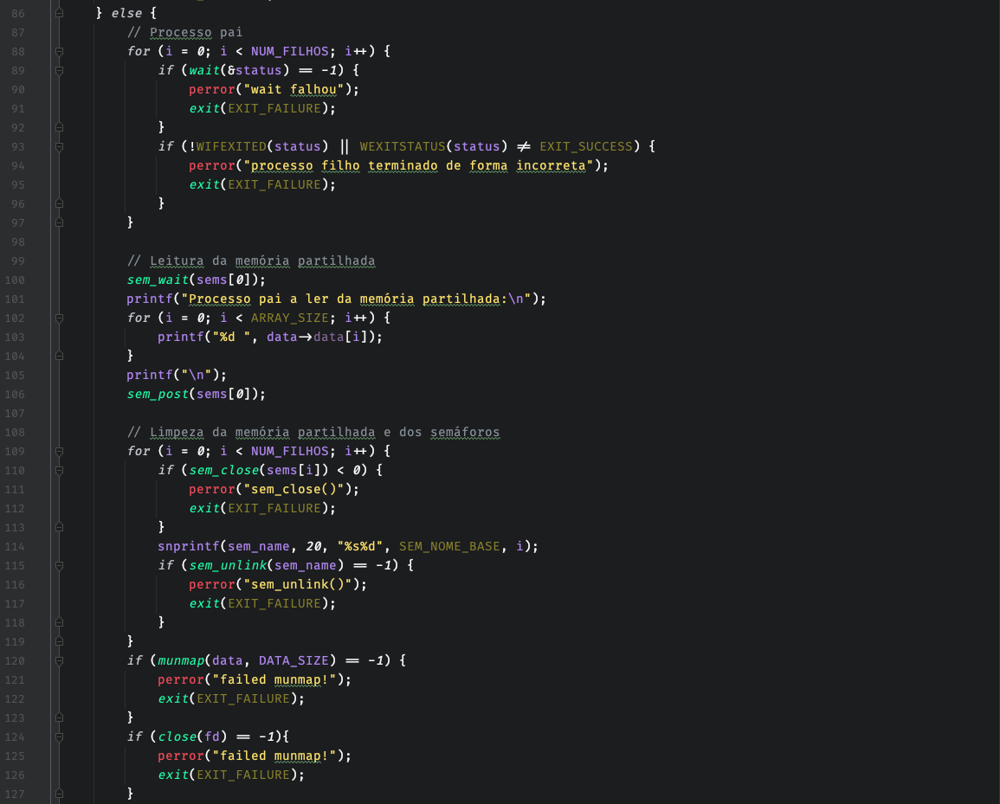
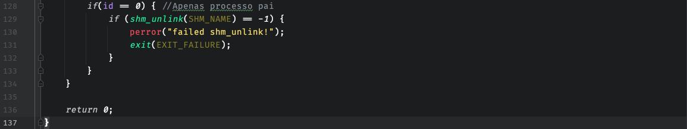
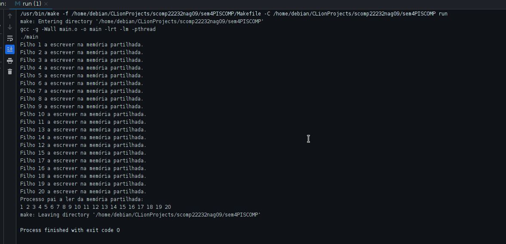

# US 3003

## 1. Context

In this task we wanted to minimize the synchronization issues that the use of shared boards
can cause. The users can be accessing the same board at the same time, and if they are
the changes made by one user can be overwritten by the other. To avoid this we decided to
implement a prototype solution that would allow some users to access the shared memory space 
at the same time, but only one user would be able to write at a time. This would be done by
using semaphores to control the access to the shared memory space.

## 2. Requirements

As Project Manager, I want the team to "explore" the synchronization problems related to the shyncronization
of shared boards and design a conceptual solution based on practical evidence.

## 3. Analysis

[Project Anaysis](projectAnalysis.md)

## 4. Design

### 4.1. Algorithm

### 4.2. Class Diagram

### 4.3. Sequence Diagram

## 5. Implementation

## 6. Integration/Demonstration

## 7. Observations

*N/A*