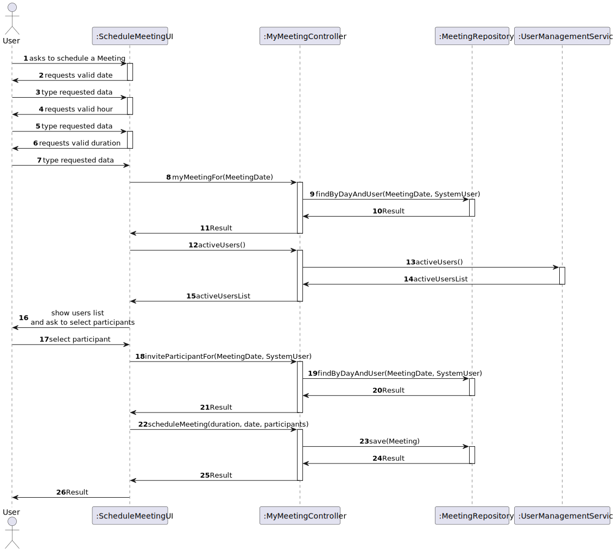
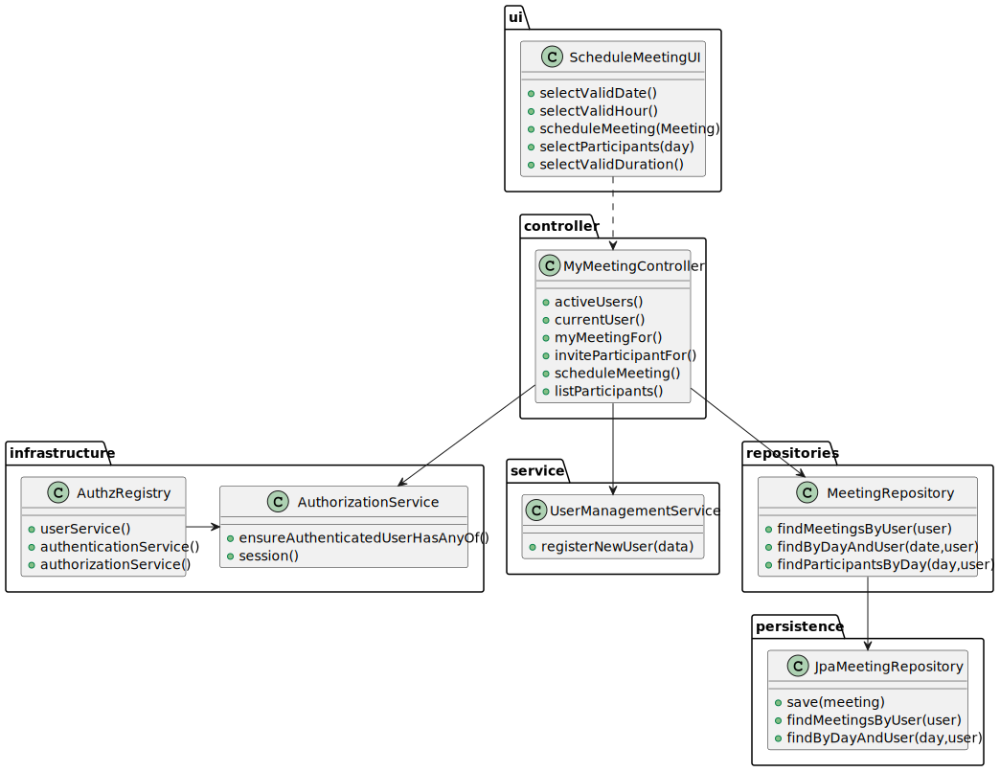

# US4001- As User, I want to schedule a Meeting

## Context

New feature to be developed.
## Requirements

US4001- As User, I want to schedule a Meeting

**Github Issue:** #9

##  Client Clarifications

[Questions and Answers](./ClientQuestions.md)

####  Sequence Diagram

####  Class Diagram

