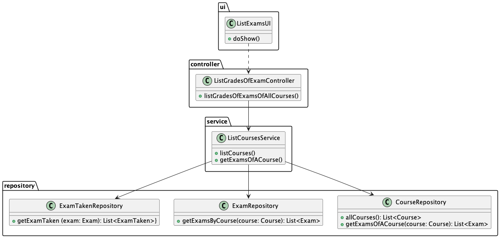

# US2006 - View a list of the grades of exams of my courses.

## 1. Context

New feature to be developed.

**Github issue:** #78

## 2. Requirements

As a teacher, I want to be able to view a list of the grades of exams for my courses, so that I can keep track of my
students' progress and identify areas where they need to improve.

## 2.1 Client Clarifications

Q: Um professor deve conseguir ver as notas de um curso específico, de todos os seus cursos ao mesmo tempo, ou ambos?
R: Penso que seria interessante ter todas as possibilidades que mencionou. Como sugestão, talvez apresentar os cursos do
professor e este poder indicar quais os cursos que quer ver ou "todos".

Q: Os exames formativos são gerados automaticamente e, não existindo um registo das perguntas e respostas desses exames,
não penso que faça sentido armazenar os resultados dessas notas.No entanto, o sistema deve apresentar para estes exames
o feedback e a nota no final.

R: Os exames formativos são gerados automaticamente e, não existindo um registo das perguntas e respostas desses exames,
não penso que faça sentido armazenar os resultados dessas notas

---

## 2.2 Demos

## 3. Analysis

### 3.1 Pre Requirements

- Course must exist
- Exam must exist
- Exame resolved

### 3.2 Post Requirements

- The professor can access the exam grades.

### 3.3 Business Rules

- A course can have multiple exams
- Only one student can have a grade per exam

## 4. Design

### 4.1. Realization

#### 4.1.1. UC Realizatio

* The teacher initiates the process by selecting the option to view the grades for each exam.
* The system presents a list of courses with the grades associated with each exam.

#### 4.1.2. Sequence Diagram


#### 4.1.3 Class Diagram



## 4.2 Applied Patterns

### 4.2.1 Architectural  Pattern

An **Onion Architectural Pattern** was used in order to achieve a lower coupling of the system since the dependency was
from the outer to the inner layer. A better maintainability of the system is another consequence of the chosen design

**presentation -> application -> service -> Repository**

### 4.2.2 Design Patters

#### Controller

The controller pattern assigns the responsibility of dealing with system events to a non-UI class that represents the
overall system or a use case scenario.
In this UseCase **OpenCloseEnrollmentsController** is responsible for organising the use case logic.

#### Factory and Repository

These patterns helped in the persistence, storage and data access.
It is used in the instantiation of the **CourseRepository** in order for the system to have access to the
TeacherAssignment data and save the new TeacherAssignment.
The repositories are accessed by the RepositoryFactory using the Service class.

#### High-Cohesion, Low-Coupling

**Low coupling** is an evaluative pattern that dictates how to assign responsibilities for the following benefits:

* lower dependency between the classes,
* change in one class having a lower impact on other classes,
* higher reuse potential.

**High cohesion** means that the responsibilities of a given set of elements are strongly related and highly focused on
a rather specific topic.

In this UseCase we can see in the following examples:

* CourseRepository is just a repository of Courses, where the data related to them are saved and accessed;
* ListCourseToEnrollmentService is a class that connects to the course repositories and returns the data to the
  controller.

#### Information Expert

This pattern leads to placing the responsibility on the class with the most information required to fulfill it.

## 4.3 Tests

N/A

## 5. Implementation

```
    public StringBuilder listGradesOfExamsOfAllCourses() {
        StringBuilder sb = new StringBuilder();
        for (var course : listCourseService.allCourses()) {
            sb.append("→ ")
                    .append(course.name())
                    .append("\n");
            for (var exam : course.getExams()) {
                sb.append("\t⌊ ")
                        .append(exam.title())
                        .append("\n");
                for (ExamTaken examTaken : exam.getExamTaken()) {
                    sb.append("\t\t⌊ ")
                            .append(examTaken.getStudent().mecanographicNumber())
                            .append(" → ")
                            .append(examTaken.grade())
                            .append("\n");
                }
            }
        }
        return sb;
    }
```

## 6. Integration/Demonstration

*N/A*

## 7. Observations

**Last minute we had to rename the project and this US is not aligned with the Master, in the next sprint we will take
that into consideration.*
