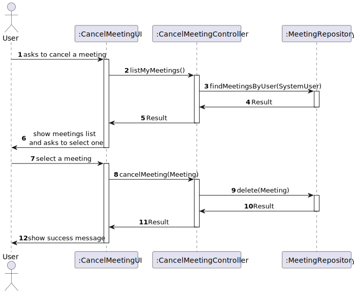
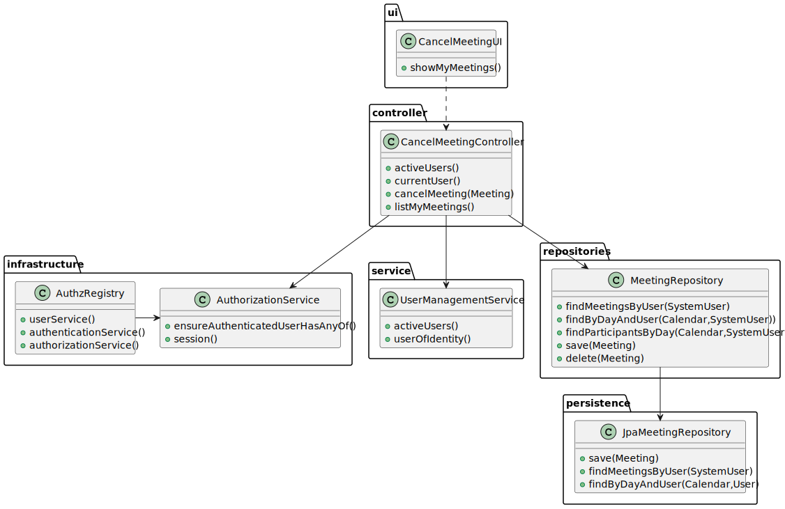

# US4002 - As User, I want to cancel a meeting.

## Context

New feature to be developed.
## Requirements

US4002 - As User, I want to cancel a meeting.

**Github Issue:** #75

##  Client Clarifications

[Questions and Answers](./ClientQuestions.md)

####  Sequence Diagram

####  Class Diagram

