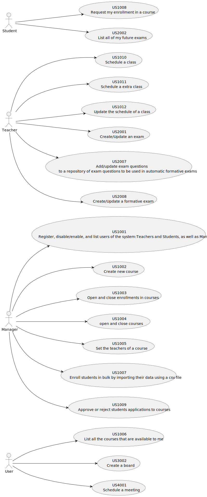
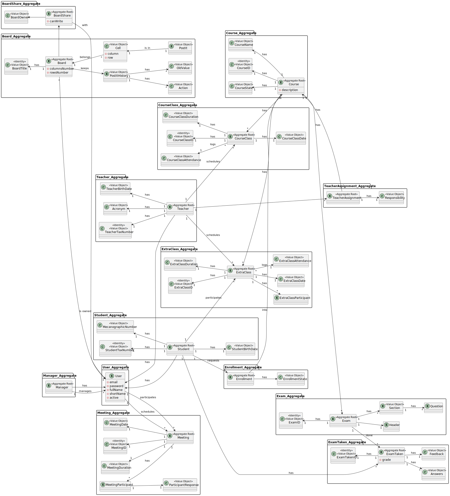

# Project Planning and Technical Documentation

## 1. Group Members

The members of the group:

| Student Nr.                              | Name            |
|------------------------------------------|-----------------|
| **[1050347](members/1050347/readme.md)** | Simão Gomes     |
| **[1171159](members/1171159/readme.md)** | Filipe Teixeira |
| **[1171311](members/1171311/readme.md)** | Henrique Silva  |
| **[1222132](members/1222132/readme.md)** | Diogo Sousa     |
| **[1960184](members/1960184/readme.md)** | João Silva      |

[SEM4PI - Compromisso de Honra](o Sprint_A%2FSEM4PI%20-%20Compromisso%20de%20Honra%202NA-G001.pdf)

## 2. Task Assignment

The assignment of tasks (requirements/user stories/use cases) during the project.

| Student Nr.                              | Sprint A                                                                                                                                                                                                      | Sprint B                                                                                                                                                                                                            | Sprint C |
|------------------------------------------|---------------------------------------------------------------------------------------------------------------------------------------------------------------------------------------------------------------|---------------------------------------------------------------------------------------------------------------------------------------------------------------------------------------------------------------------|----------|
| **[1050347](members/1050347/readme.md)** | [US-G002](Sprint_A/us_g002/readme.md) [US-G003](Sprint_A/us_g003/readme.md)  [US-G004](Sprint_A/us_g004/readme.md)  [US-G005](Sprint_A/us_g005/readme.md)  [US-G006](Sprint_A/us_g006/readme.md)  | [US1003](Sprint_B%2FUS1003%2Freadme.md) [US1006](Sprint_B%2FUS1006%2Freadme.md) [US1008](Sprint_B%2FUS1008%2Freadme.md) [US1012](Sprint_B%2FUS1012%2Freadme.md)                                            |          |
| **[1171159](members/1171159/readme.md)** | [US-G002](Sprint_A/us_g002/readme.md)  [US-G003](Sprint_A/us_g003/readme.md)  [US-G004](Sprint_A/us_g004/readme.md)  [US-G005](Sprint_A/us_g005/readme.md)  [US-G006](Sprint_A/us_g006/readme.md) | [US2002](Sprint_B%2FUS2002%2Freadme.md) [US2003](Sprint_B%2FUS2003%2Freadme.md) [US2008](Sprint_B%2FUS2008%2Freadme.md) [US3001](Sprint_B%2FUS3001%2Freadme.md)                                            |          |
| **[1171311](members/1171311/readme.md)** | [US-G002](Sprint_A/us_g002/readme.md)  [US-G003](Sprint_A/us_g003/readme.md)  [US-G004](Sprint_A/us_g004/readme.md)  [US-G005](Sprint_A/us_g005/readme.md)  [US-G006](Sprint_A/us_g006/readme.md) | [US1005](Sprint_B%2FUS1005%2Freadme.md) [US1009](Sprint_B%2FUS1009%2Freadme.md) [US1010](Sprint_B%2FUS1010%2Freadme.md) [US1011](Sprint_B%2FUS1011%2Freadme.md) [US3002](Sprint_B%2FUS3002%2Freadme.md) |          |
| **[1222132](members/1222132/readme.md)** | [US-G002](Sprint_A/us_g002/readme.md)  [US-G003](Sprint_A/us_g003/readme.md)  [US-G004](Sprint_A/us_g004/readme.md)  [US-G005](Sprint_A/us_g005/readme.md)  [US-G006](Sprint_A/us_g006/readme.md) | [US2001](Sprint_B%2FUS2001%2Freadme.md) [US2007](Sprint_B%2FUS2007%2Freadme.md) [US4001](Sprint_B%2FUS4001%2Freadme.md) [US5001](Sprint_B%2FUS5001%2Freadme.md)                                            |          |
| **[1960184](members/1960184/readme.md)** | [US-G002](Sprint_A/us_g002/readme.md)  [US-G003](Sprint_A/us_g003/readme.md)  [US-G004](Sprint_A/us_g004/readme.md)  [US-G005](Sprint_A/us_g005/readme.md)  [US-G006](Sprint_A/us_g006/readme.md) | [US1007](Sprint_B%2FUS1007%2Freadme.md) [US3003](Sprint_B%2FUS3003%2Freadme.md) [US1002](Sprint_B%2FUS1002%2Freadme.md) [US1004](Sprint_B%2FUS5001%2Freadme.md)                                            |          |

## 3. Glossary

**[Glossary](Glossary.md)**

## 4. Client Questions/Answers compilation

**[Compilation](ClientQuestions.md)**

## 4. Technical Decisions

### Database

The project should use of an "in memory" database, as well a persistent database.
In memory: H2
Persistent: Oracle

### Application Framework to Use

EAPLI Framework

## 5. Project Structure

### Use Case Diagram

### Domain Model

### Documentation

The documentation folder structure is organized in:

* a members folder where each member of the team has is personal folder named by the ISEP mecanograaphic number.
* A folder for each Sprint with sub-folders for each user story to be developed in the sprint.

### Source

The application(s) source files are under the src folder.